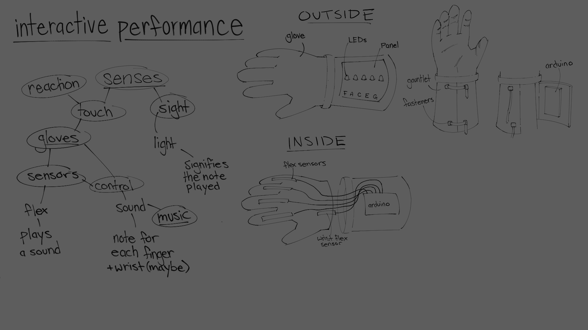
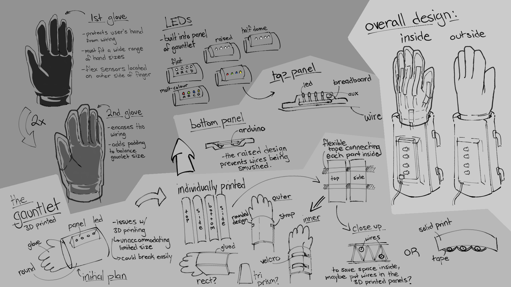

# Conductor's Hand

## Description
The project is about building a glove device where each of your five fingers will play different notes and light up each of the LEDs while moving your wrist changes the octave of the sound. This device involves the movement of your lower arm which includes your wrist, hand, and fingers to generate the sound.

## Design Process
### Iterations
#### 1

#### 2 & 3



### Pseudocode
```c++
/// Initialize the glove

/// If one of the fingers (0-5) have either moved up or down
	/// Set the designated frequency for that finger 
	/// If the wrist moves up
		/// Set to the upper octave
	/// Else if the wrist moves down
		/// Set to the lower octave
	/// Else
		/// Set to the current octave
	/// Play Sound
	/// Light the Designated LED
/// Else if two or more fingers either move up or down
	/// Set the designated frequencies for the detected fingers
	/// If the wrist moves up
		/// Set to the upper octave
	/// Else if the wrist moves down
		/// Set to the lower octave
	/// Else
		/// Set to the current octave
	/// Play Sound
	/// Light the Designated LEDs
/// END
```

### Components Parts
- Gloves (2x)
- KT Tape
- Copper Wires
- Graphite Colored Paper (5x)
- 3D Printed Wrist Gauntlet
- LEDs (5x)
- Aux Speaker Pin
- 5 Flex Sensors
- Electrical Terminals
- Velcro (Fasteners)


## Tasks Done So Far
- Aldrin Azucena
	- Created 5 Homemade Flex Sensors
	- Experiment with Sound Synths on the Arduino Code
	- Bought materials for the project ($18)
		- Aluminum Foil
		- KT Tape
- Xavier Brooks
  - Powerpoint presentation
- Sophia Mai
	- Design Iterations 
	- Bought 3 Pairs of Gloves ($5)

## TODO
- Build The glove
  - Flex Sensors
  - LEDs
  - 3.5 Audio Jack
- Develop the code
  - Sound Synth
  - LED system
- 3D Print the Gauntlet Casing for the Arduino and Adjust based on the project
  - [Arduino Holder](https://www.thingiverse.com/thing:1252601)
  - [Forearm Split 1](https://www.thingiverse.com/thing:3613626/files)